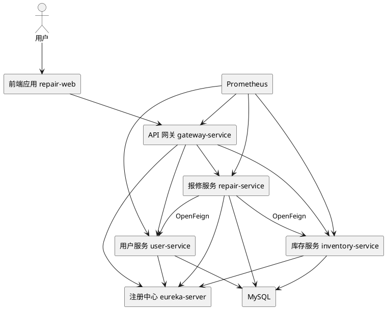
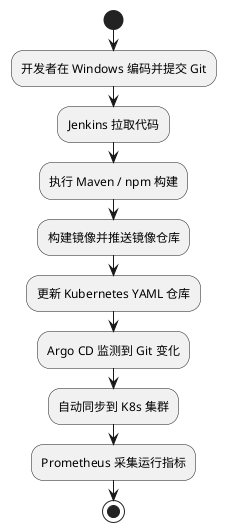

# 校园报修与备件管理平台技术架构文档

## 1. 文档目标

本文档用于说明课程实践项目的技术选型、系统架构、部署方式、运行拓扑和开发分工，确保项目满足以下要求：

1. 使用 VMware 搭建 2-3 台虚拟机
2. 虚拟机中使用 `containerd + Kubernetes 1.28`
3. 后端基于 Spring Cloud 微服务架构
4. 实现 Feign 调用、负载均衡、熔断
5. 使用 API Gateway 实现认证与路由
6. 使用 Jenkins + GitOps 思路完成 CI/CD
7. 使用 Prometheus 完成监控

## 2. 总体架构

## 2.1 架构分层

系统分为 5 层：

1. 表现层：Vue 3 前端应用
2. 接入层：Spring Cloud Gateway
3. 业务层：用户服务、报修服务、库存服务
4. 治理层：Eureka、OpenFeign、LoadBalancer、Resilience4j
5. 平台层：Kubernetes、containerd、Jenkins、Argo CD、Prometheus

## 2.2 架构图



## 3. 技术栈选型

## 3.1 后端技术栈

| 类别 | 选型 |
|---|---|
| 语言 | Java 17 |
| 框架 | Spring Boot 3.x |
| 微服务 | Spring Cloud 2023 |
| 服务调用 | OpenFeign |
| 负载均衡 | Spring Cloud LoadBalancer |
| 熔断降级 | Resilience4j |
| 服务注册发现 | Eureka Server |
| 网关 | Spring Cloud Gateway |
| 构建工具 | Maven |
| 数据库 | MySQL 8 |

### 选型原因
1. Spring Cloud 是课程明确要求，教学资料多，适合答辩。
2. Eureka 作为注册中心结构清晰，便于解释“服务注册与发现”。
3. OpenFeign + LoadBalancer + Resilience4j 可以完整覆盖课程要求中的三项核心实践。

## 3.2 前端技术栈

| 类别 | 选型 |
|---|---|
| 框架 | Vue 3 |
| 工具链 | Vite |
| UI 组件 | Element Plus |
| HTTP | Axios |
| 状态管理 | Pinia |
| 路由 | Vue Router |

### 选型原因
1. 上手快，适合课程周期。
2. 可轻松实现现代化侧栏、抽屉、后台管理风格。
3. 开发阶段可在 Windows 本机通过 Node.js 独立启动。

## 3.3 云原生与运维技术栈

| 类别 | 选型 |
|---|---|
| 虚拟化平台 | VMware Workstation |
| 容器运行时 | containerd |
| 集群编排 | Kubernetes 1.28 |
| 网络插件 | Calico |
| Dashboard | Kubernetes Dashboard |
| CI | Jenkins |
| CD / GitOps | Argo CD |
| 监控 | Prometheus |
| 脚本 | Bash |
| 编排文件 | YAML |

## 4. 环境分工：到底在哪里开发

这是你当前最需要明确的问题，结论如下。

### 4.1 推荐分工

#### Windows 本机负责
1. 编写 Java 代码
2. 编写前端 Vue 代码
3. 使用 IntelliJ IDEA / VS Code 开发
4. 使用 Git 管理项目
5. 编写 YAML、Markdown、Bash 脚本
6. 本地启动前端和单体调试后端接口

#### VMware 虚拟机负责
1. 搭建 Kubernetes 集群
2. 安装并运行 containerd
3. 部署 Eureka、Gateway、各业务微服务
4. 部署 Jenkins、Argo CD、Prometheus、Dashboard
5. 进行课程验收时的集群演示

### 4.2 为什么不建议直接在虚拟机里完成全部开发
1. 虚拟机图形界面与 IDE 使用体验较差。
2. 代码编辑、依赖下载、前端调试都明显慢于 Windows 本机。
3. 虚拟机更适合作为“运行环境”和“部署环境”，而不是主要开发环境。

### 4.3 最终推荐开发模式
**Windows 开发，虚拟机部署。**

这也是最符合课程实践效率的方式。

## 5. 微服务设计

## 5.1 服务列表

| 服务名 | 类型 | 端口 | 职责 |
|---|---|---:|---|
| `eureka-server` | 基础设施 | 8761 | 服务注册与发现 |
| `gateway-service` | 基础设施 | 8080 | 统一认证、鉴权、路由 |
| `user-service` | 用户微服务 | 8081 | 用户、角色、登录、用户查询 |
| `repair-service` | 业务微服务 | 8082 | 报修工单管理 |
| `inventory-service` | 业务微服务 | 8083 | 备件库存管理 |
| `repair-web` | 前端 | 5173/80 | 页面展示与交互 |

## 5.2 服务调用关系

### 主调用链
1. 前端 -> 网关
2. 网关 -> 各业务服务
3. 报修服务 -> 用户服务（查询报修人、维修人）
4. 报修服务 -> 库存服务（库存校验、扣减）

### 课程要求映射
1. Feign 服务调用：`repair-service -> user-service / inventory-service`
2. Feign 负载均衡：`inventory-service` 部署多副本
3. Feign 熔断：库存服务不可用时返回降级结果

## 5.3 熔断设计

当 `inventory-service` 不可用或响应超时时：

1. `repair-service` 通过 Resilience4j 进入 fallback
2. 返回提示：“库存服务暂时不可用，工单已保存但暂未扣减备件”
3. 工单状态保持在“处理中”
4. 后续可由管理员重试扣减或人工处理

这样既满足课程要求，也能在答辩中清楚展示“系统在下游故障时仍可部分可用”。

## 6. 数据库设计

为了降低课程实现难度，建议使用 **1 个 MySQL 实例 + 3 个 schema** 的方式：

1. `user_db`
2. `repair_db`
3. `inventory_db`

这比每个服务单独部署一个 MySQL 更适合课程时间安排，同时仍保留“每个服务逻辑隔离”的结构。

## 6.1 DBML 设计

```dbml
Table user_db.users {
  id bigint [pk, increment]
  username varchar
  password varchar
  real_name varchar
  phone varchar
  role varchar
  status int
  created_at datetime
}

Table repair_db.repair_order {
  id bigint [pk, increment]
  order_no varchar
  title varchar
  location varchar
  description text
  reporter_id bigint
  assignee_id bigint
  status varchar
  repair_note text
  created_at datetime
  updated_at datetime
}

Table repair_db.repair_part_usage {
  id bigint [pk, increment]
  repair_order_id bigint
  part_id bigint
  quantity int
}

Table inventory_db.parts {
  id bigint [pk, increment]
  part_name varchar
  part_code varchar
  stock int
  warning_stock int
  unit varchar
  updated_at datetime
}
```

## 7. API 网关设计

## 7.1 网关职责
1. 所有请求统一入口
2. 登录接口放行
3. 非登录接口统一校验 JWT
4. 按路径转发服务
5. 统一跨域配置

## 7.2 路由建议

| 路由前缀 | 转发目标 |
|---|---|
| `/api/users/**` | `user-service` |
| `/api/repairs/**` | `repair-service` |
| `/api/inventory/**` | `inventory-service` |

## 8. Kubernetes 部署架构

## 8.1 节点规划

| 节点 | 角色 | 主要职责 |
|---|---|---|
| `k8s-master` | Master | 控制面、Dashboard、Jenkins、Argo CD、Prometheus |
| `k8s-worker1` | Worker | 业务服务 Pod |
| `k8s-worker2` | Worker | 业务服务 Pod 与扩容副本 |

## 8.2 命名空间规划

| 命名空间 | 用途 |
|---|---|
| `cloud-native-system` | Eureka、Gateway、业务服务、前端 |
| `cicd` | Jenkins、Argo CD |
| `monitoring` | Prometheus |
| `kubernetes-dashboard` | Dashboard |

## 8.3 资源对象规划

每个服务至少包含：
1. `Deployment`
2. `Service`
3. `ConfigMap`
4. `Secret`（如数据库密码、JWT 密钥）

数据库若部署在集群内，还应增加：
1. `PersistentVolumeClaim`
2. `StatefulSet` 或 `Deployment`

## 9. CI/CD 与 GitOps 设计

## 9.1 推荐流程



## 9.2 角色划分
1. Jenkins 负责持续集成：拉代码、编译、打包、构建镜像
2. Argo CD 负责持续部署：监听 Git 仓库中的 YAML 变化并同步到集群
3. Prometheus 负责发布后的监控验证

## 10. 监控方案

## 10.1 监控目标
1. 服务是否存活
2. 请求是否异常
3. 响应时间是否过长
4. JVM 指标是否异常
5. Pod 是否重启

## 10.2 实现方式
1. Spring Boot Actuator 暴露 `/actuator/prometheus`
2. Prometheus 配置抓取目标
3. 通过 Dashboard 和 `kubectl get pods` 观察部署状态

## 11. 目录结构建议

```text
cloud-native-repair-platform/
├─ README.md
├─ docs/
│  ├─ 01-系统企划书.md
│  ├─ 02-技术架构文档.md
│  └─ 03-开发教学与两周日程.md
├─ backend/
│  ├─ eureka-server/
│  ├─ gateway-service/
│  ├─ user-service/
│  ├─ repair-service/
│  └─ inventory-service/
├─ frontend/
│  └─ repair-web/
├─ deploy/
│  ├─ namespace/
│  ├─ mysql/
│  ├─ eureka/
│  ├─ gateway/
│  ├─ user-service/
│  ├─ repair-service/
│  ├─ inventory-service/
│  ├─ prometheus/
│  ├─ jenkins/
│  └─ argocd/
└─ scripts/
   ├─ init-k8s.sh
   ├─ join-worker.sh
   └─ deploy-all.sh
```

## 12. 风险与规避

## 12.1 主要风险
1. 虚拟机网络配置错误，导致节点无法通信
2. 注册中心或网关先后顺序不当，导致服务启动失败
3. K8s 镜像拉取慢
4. 学生对 Jenkins、Argo CD 不熟悉

## 12.2 规避策略
1. 先完成 3 台虚拟机 IP 与主机名配置
2. 先在 Windows 本机跑通微服务，再上 K8s
3. 优先完成用户、报修、库存三个服务的核心链路
4. 先完成手工部署，再补 Jenkins 与 Argo CD

## 13. 架构结论

本架构在技术上覆盖课程全部关键指标，在实现上分层清楚、演示逻辑完整、难度适中。特别是“Windows 开发，虚拟机部署”的方式，既适合你的当前能力，也能最大化减少环境配置压力。
