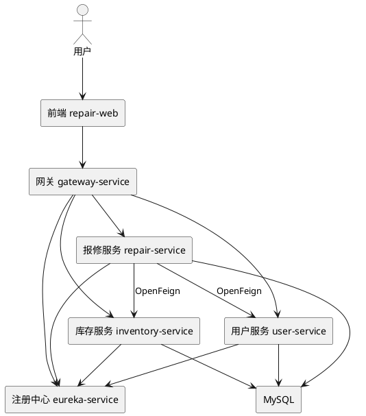
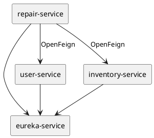

# 校园报修与备件管理平台技术架构文档

## 1. 文档目标

本文档不再按“最终系统一次性展开”的方式描述，而是**严格按照老师 PDF 的实践一、实践二、实践三顺序**来说明：

1. 每一阶段先做什么
2. 每一阶段暂时不要做什么
3. 当前阶段完成后，下一阶段才能接什么内容
4. 最终如何从“三次实践”自然过渡到完整课程项目

如果后续开发过程与本文档冲突，**以“实践一 -> 实践二 -> 实践三”的顺序为准**。

## 2. 必须先记住的顺序规则

老师 PDF 的顺序不是建议，而是本项目的主线。

### 2.1 实践一先做什么

实践一的关键词只有 4 组：

1. Maven 聚合项目
2. 子项目 `eureka-service`
3. 数据库创建
4. Eureka 服务注册原理

这意味着：

1. 先建父工程
2. **第一个完成的子项目必须是 `eureka-service`**
3. 先把数据库环境和库结构准备好
4. 此时还**不要求**先做 Feign、网关、熔断

### 2.2 实践二再做什么

实践二才进入：

1. Feign 服务调用
2. Feign 负载均衡
3. 所开发服务的注册与发现
4. 每个微服务所用的数据库及表

这意味着：

1. 没做完实践一，不进入业务微服务联动
2. 实践二的重点是“服务提供者 + 服务使用者”
3. 这时才去实现 `user-service`、`inventory-service`、`repair-service`
4. 这时才真正把各服务的数据表落地

### 2.3 实践三最后做什么

实践三才进入：

1. 基于 OpenFeign 的网关熔断处理
2. Gateway API 网关实现
3. 访问权限验证实现

这意味着：

1. **`gateway-service` 不应该在实践一阶段优先开发**
2. 熔断必须建立在实践二服务调用已经跑通的基础上
3. 权限校验也属于实践三，不应提前喧宾夺主

## 3. 老师 PDF 内容拆解

### 3.1 实践一原始要求

老师 PDF 原文核心要求：

1. 分组 2 人一组
2. 选择题目并确定开发的微服务
3. 完成聚合项目的创建
4. 完成父项目的创建
5. 完成子项目 `eureka-service`，实现自身的注册
6. 完成数据库的创建
7. 安装 MySQL（推荐 MySQL 8.0.26）
8. 设计微服务用的数据库
9. 掌握 Eureka 服务注册原理

### 3.2 实践二原始要求

老师 PDF 原文核心要求：

1. 基于 Feign 的服务调用
2. 完成所有服务提供者和服务使用者
3. 完成基于 Feign 的负载均衡
4. 实现所开发服务的注册及发现
5. 实现每个微服务所用的数据库及表

### 3.3 实践三原始要求

老师 PDF 原文核心要求：

1. 基于 OpenFeign 的网关熔断处理
2. 实现项目的熔断机制
3. 验证熔断机制的有效性
4. Gateway API 网关的实现
5. 访问权限验证的实现

## 4. 项目最终态总览

虽然实施顺序必须按三次实践推进，但最终系统仍然是一个完整的校园报修平台。

### 4.1 最终服务清单

| 服务名 | 角色 | 出现阶段 | 说明 |
|---|---|---|---|
| `eureka-service` | 注册中心 | 实践一 | 第一个必须完成的子项目 |
| `user-service` | 服务提供者 | 实践二 | 用户信息、登录、角色 |
| `inventory-service` | 服务提供者 | 实践二 | 备件库存、扣减 |
| `repair-service` | 服务使用者 + 业务服务 | 实践二 | 发起 Feign 调用，处理工单 |
| `gateway-service` | 网关 | 实践三 | 路由、权限验证、统一入口 |
| `repair-web` | 前端 | 三次实践后扩展 | 用于课程完整展示 |

### 4.2 最终关系图



注意：上图是**最终态**，不是实践一上来就全部实现。

## 5. 实践一架构设计

## 5.1 实践一的目标

实践一结束时，你应该得到的是一个“底座”，而不是完整业务系统。

必须完成：

1. 父工程创建完成
2. `eureka-service` 创建完成
3. `eureka-service` 能启动
4. MySQL 安装完成
5. 微服务数据库设计完成

### 5.2 实践一阶段允许出现的模块

实践一阶段推荐只保留以下内容：

```text
cloud-native-repair-platform/
├─ backend-parent/
│  ├─ pom.xml
│  └─ eureka-service/
├─ docs/
└─ sql/
```

这时不要急着把所有子模块一次性建完，更不要先写网关。

### 5.3 父工程设计

父工程职责：

1. 统一依赖版本
2. 统一插件版本
3. 管理所有子模块
4. 为后续实践二、实践三留出扩展入口

父工程关键要求：

1. `packaging` 必须是 `pom`
2. 统一管理 Spring Boot 与 Spring Cloud 版本
3. 后续所有微服务都挂在父工程下

### 5.4 `eureka-service` 设计

这是实践一中**第一个必须完成的子项目**。

职责非常单纯：

1. 提供服务注册中心能力
2. 为后续实践二的服务注册发现做准备

此阶段只需要先把它做对，不需要把业务服务一起带上。

### 5.5 数据库设计边界

实践一要求“完成数据库的创建”和“设计微服务用的数据库”，更偏向于**库级设计与环境准备**。

推荐先完成：

1. 安装 MySQL 8
2. 创建数据库实例
3. 规划 3 个业务 schema：
   - `user_db`
   - `repair_db`
   - `inventory_db`
4. 先画出表设计草案

这里可以先设计表，不必在实践一把所有业务接口都写完。

### 5.6 实践一完成标准

满足以下条件，才允许进入实践二：

1. 父工程可正常管理子模块
2. `eureka-service` 能正常启动
3. 已明确后续要开发哪些业务微服务
4. MySQL 已安装完成
5. 3 个业务库设计已完成
6. 你自己能说清楚什么是服务注册与发现

## 6. 实践二架构设计

## 6.1 进入实践二的前提

只有实践一完成后，实践二才开始。

实践二的关键词是：

1. 服务提供者
2. 服务使用者
3. Feign 调用
4. 负载均衡
5. 注册与发现
6. 数据库及表

### 6.2 实践二推荐新增模块顺序

推荐严格按下面顺序加模块：

1. `user-service`
2. `inventory-service`
3. `repair-service`

原因：

1. `user-service`、`inventory-service` 更适合作为服务提供者
2. `repair-service` 需要调用它们，更适合作为后做的服务使用者
3. 这样最符合“先提供，再消费”的思路

### 6.3 服务角色划分

| 服务名 | 角色 | 为什么 |
|---|---|---|
| `user-service` | 服务提供者 | 提供用户查询、登录、角色信息 |
| `inventory-service` | 服务提供者 | 提供库存查询、扣减能力 |
| `repair-service` | 服务使用者 | 通过 Feign 调用前两个服务 |

### 6.4 实践二调用关系



注意：这里依然**没有网关**，因为网关属于实践三。

### 6.5 负载均衡设计

实践二要求完成基于 Feign 的负载均衡，推荐做法：

1. 让 `inventory-service` 启动 2 个实例
2. 两个实例注册到 `eureka-service`
3. `repair-service` 通过服务名调用 `inventory-service`
4. 由 OpenFeign + LoadBalancer 在多个实例之间分发请求

本地开发时可以这样演示：

1. 同一个 `inventory-service` 工程启动两次
2. 使用不同端口，例如 `8083` 和 `8084`
3. 服务名都注册为 `inventory-service`

### 6.6 数据库与表设计

实践二不是只建数据库名，而是要把**各微服务对应的数据表真正落地**。

推荐最低表结构如下：

```dbml
Table user_db.users {
  id bigint [pk, increment]
  username varchar
  password varchar
  real_name varchar
  phone varchar
  role varchar
  status int
  created_at datetime
}

Table inventory_db.parts {
  id bigint [pk, increment]
  part_name varchar
  part_code varchar
  stock int
  warning_stock int
  unit varchar
  updated_at datetime
}

Table repair_db.repair_order {
  id bigint [pk, increment]
  order_no varchar
  title varchar
  location varchar
  description text
  reporter_id bigint
  assignee_id bigint
  status varchar
  repair_note text
  created_at datetime
  updated_at datetime
}

Table repair_db.repair_part_usage {
  id bigint [pk, increment]
  repair_order_id bigint
  part_id bigint
  quantity int
}
```

### 6.7 实践二完成标准

满足以下条件，才允许进入实践三：

1. `user-service`、`inventory-service`、`repair-service` 都已创建
2. 这 3 个服务都能注册到 `eureka-service`
3. `repair-service` 能通过 Feign 调用其他服务
4. 至少有 1 个服务调用链路已跑通
5. `inventory-service` 已完成多实例负载均衡演示
6. 每个服务所需数据库表都已真正创建

## 7. 实践三架构设计

## 7.1 进入实践三的前提

实践三的前提是：

1. 实践二服务调用已经跑通
2. 你已经有真实的 Feign 调用链
3. 你已经能人为制造下游异常

如果实践二还没通，就不要提前做网关和熔断。

### 7.2 实践三新增模块

实践三重点新增：

1. `gateway-service`
2. `repair-service` 中的熔断与降级逻辑

### 7.3 `gateway-service` 设计

网关职责：

1. 作为统一入口
2. 按路径路由到不同微服务
3. 对受保护接口做访问权限验证
4. 统一处理跨域与基础安全逻辑

推荐路由：

| 路由前缀 | 转发目标 |
|---|---|
| `/api/users/**` | `user-service` |
| `/api/inventory/**` | `inventory-service` |
| `/api/repairs/**` | `repair-service` |

### 7.4 熔断设计

实践三要求的是“基于 OpenFeign 的网关熔断处理”，在本项目里推荐把熔断点放在：

`repair-service -> inventory-service`

原因：

1. 这条链路最容易人工制造异常
2. 业务含义清晰，答辩时容易解释
3. 降级结果也容易设计

推荐降级逻辑：

1. `inventory-service` 超时或不可用
2. `repair-service` 进入 fallback
3. 返回“库存服务暂时不可用，请稍后重试”
4. 工单保持在“处理中”或“待确认库存”状态

### 7.5 权限验证设计

实践三明确要求实现访问权限验证。

推荐最小实现方式：

1. 登录成功后签发 JWT
2. `gateway-service` 校验 JWT
3. 放行登录接口
4. 拦截未登录访问的受保护路径

### 7.6 实践三完成标准

满足以下条件，实践三才算完成：

1. `gateway-service` 已完成统一路由
2. 未登录访问受保护接口时会被拦截
3. 登录后带 Token 能正常访问
4. 人为让下游服务异常时，熔断逻辑会生效
5. 你能展示并解释“熔断为什么有效”

## 8. 三次实践完成后的课程项目扩展

老师 PDF 的三次实践是主干；完整课程项目还可以继续扩展，但这些内容**应放在三次实践之后**：

1. 前端项目 `repair-web`
2. Kubernetes 多节点部署
3. Kubernetes Dashboard
4. Jenkins
5. Prometheus
6. Argo CD

### 8.1 为什么这些要后置

因为这些内容会增加环境复杂度，但不属于老师 PDF 中实践一二三的核心起步顺序。

更稳的方式是：

1. 先把三次实践核心要求做通
2. 再上 K8s、Jenkins、Prometheus
3. 最后补前端展示与答辩包装

## 9. 开发环境分工

### 9.1 Windows 本机负责

1. Java 编码
2. 前端编码
3. Maven 构建
4. 文档编写
5. SQL 与 YAML 编写
6. 本地联调

### 9.2 VMware 虚拟机负责

1. 作为课程部署环境
2. 作为 Kubernetes 集群运行环境
3. 安装 Dashboard、Jenkins、Prometheus
4. 做最终演示

### 9.3 当前阶段的建议

由于你现在只装了一台虚拟机，因此建议：

1. 三次实践主开发先在 Windows 本机完成
2. 虚拟机先负责熟悉环境和后续集群准备
3. 等三次实践主链路完成后，再扩展到多虚拟机部署

## 10. 推荐目录结构

按阶段推进时，推荐目录结构如下：

```text
cloud-native-repair-platform/
├─ README.md
├─ docs/
│  ├─ 01-系统企划书.md
│  ├─ 02-技术架构文档.md
│  └─ 03-开发教学与两周日程.md
├─ backend-parent/
│  ├─ pom.xml
│  ├─ eureka-service/
│  ├─ user-service/
│  ├─ inventory-service/
│  ├─ repair-service/
│  └─ gateway-service/
├─ frontend/
│  └─ repair-web/
├─ sql/
│  ├─ user_db.sql
│  ├─ repair_db.sql
│  └─ inventory_db.sql
├─ deploy/
└─ scripts/
```

## 11. 最容易做乱的地方

### 11.1 反例 1：一开始就先写网关

不建议。因为老师 PDF 中网关属于实践三。

### 11.2 反例 2：还没写注册中心就先写业务联调

不建议。因为实践一要求先完成 `eureka-service`。

### 11.3 反例 3：只有库名，没有表

不够。因为实践二明确要求“每个微服务所用的数据库及表”。

### 11.4 反例 4：熔断没有验证场景

不够。因为实践三明确要求“验证熔断机制的有效性”。

## 12. 架构结论

本项目的正确推进方式不是“把所有技术点一起铺开”，而是：

1. **实践一先完成父工程 + `eureka-service` + 数据库创建**
2. **实践二再完成业务微服务 + Feign 调用 + 负载均衡 + 数据表**
3. **实践三最后完成网关 + 权限验证 + 熔断与验证**

只要始终遵守这条主线，后续再接前端、K8s、Jenkins、Prometheus，整个项目就会非常顺，不容易乱。
